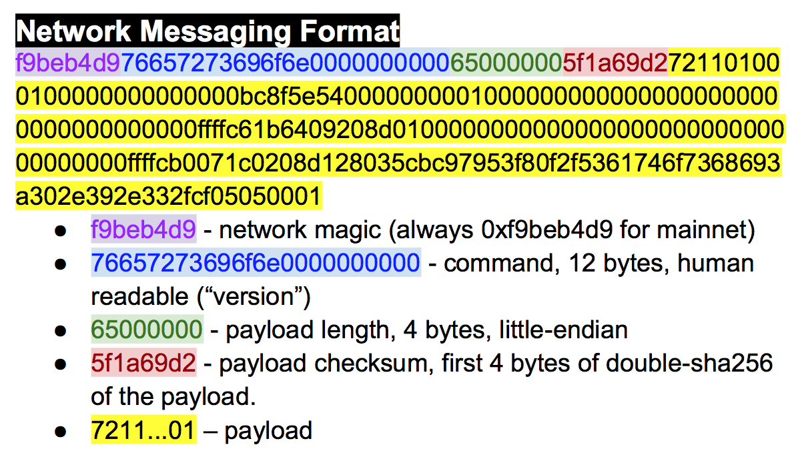

# Networking

The peer-to-peer network that Bitcoin runs on is what gives it a lot of its robustness. 9898 nodes are running on the network as of this writing and communicate constantly.

The Bitcoin network is a broadcast network or a gossip network. Every node is constantly announcing different transactions, blocks and peers that it knows about. The protocol is rich and has a lot of features that have been added to it over the years. Two things to understand first about the Bitcoin networking protocol.The nice thing about the networking protocol is that it is not consensus critical. The same data can be sent from one node to another in some other fashion and the blockchain itself would not be affected.

With that in mind, let's start with the very first message that one node sends to another, the version message.

### Network Messages

Network messages have a particular form.

The first four bytes are always the same and are referred to as the *network magic*. Magic bytes are common in network programming as the communication can be spotty and asynchronous. Magic bytes give the receiver a place to start should the communication get interrupted.

The next 12 bytes define the command, or what the payload actually carries. Note that the command is meant to be human-readable and in fact this message is "version" in ascii with 0-byte padding.

The next 4 bytes determine the length of the payload. As we saw in the transaction and block parsing sections, this is necessary as the field is of variable length. As 2^32 is about 4 billion, we can have payloads that can be as big as 4 GB. Note the number is interpreted in little-endian, so in our case here, that is 101 bytes.

The next 4 bytes are the checksum. The checksum algorithm is something of an odd choice as it's the first 4 bytes of the double-sha256 of the payload. I say odd, as normally, networking protocol checksums generally are designed to have error-correcting capability and double-sha256 has none. That said, the hash function is common in the rest of the protocol and is thus used here.



### Try it

#### Check the [cheat sheet](https://drive.google.com/file/d/1XRby_QYBm5LvEv2rDqxJuKn_8ZsV1RHB/view) for the network message structure.

#### 9.1. Parse this message
```
f9beb4d976657261636b000000000000000000005df6e0e2
```


```python
# Exercise 9.1

msg = bytes.fromhex('f9beb4d976657261636b000000000000000000005df6e0e2')

# first 4 are network magic
magic = msg[:4]
# next 12 are command
command = msg[4:16]
# next 4 are payload length
payload_length = msg[16:20]
# next 4 are checksum
checksum = msg[20:24]
# rest is payload
payload = msg[24:]
print(command)
```

# Test Driven Exercise


```python
from io import BytesIO
from network import NetworkEnvelope
from helper import (
    double_sha256,
    int_to_little_endian,
    little_endian_to_int
)

NETWORK_MAGIC = b'\xf9\xbe\xb4\xd9'


class NetworkEnvelope(NetworkEnvelope):
    
    @classmethod
    def parse(cls, s):
        '''Takes a stream and creates a NetworkEnvelope'''
        # check the network magic NETWORK_MAGIC
        magic = s.read(4)
        if magic != NETWORK_MAGIC:
            raise RuntimeError('magic is not right')
        # command 12 bytes
        command = s.read(12)
        # payload length 4 bytes, little endian
        payload_length = little_endian_to_int(s.read(4))
        # checksum 4 bytes, first four of double-sha256 of payload
        checksum = s.read(4)
        # payload is of length payload_length
        payload = s.read(payload_length)
        # verify checksum
        calculated_checksum = double_sha256(payload)[:4]
        if calculated_checksum != checksum:
            raise RuntimeError('checksum does not match')
        return cls(command, payload)

    def serialize(self):
        '''Returns the byte serialization of the entire network message'''
        # add the network magic NETWORK_MAGIC
        result = NETWORK_MAGIC
        # command 12 bytes
        result += self.command
        # payload length 4 bytes, little endian
        result += int_to_little_endian(len(self.payload), 4)
        # checksum 4 bytes, first four of double-sha256 of payload
        result += double_sha256(self.payload)[:4]
        # payload
        result += self.payload
        return result
```
